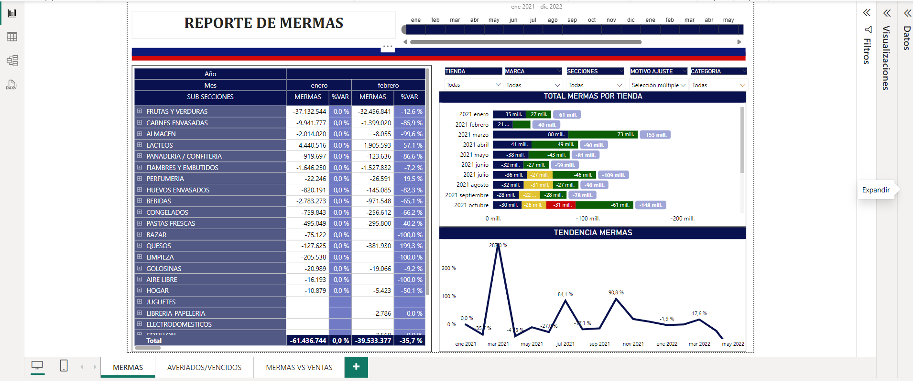
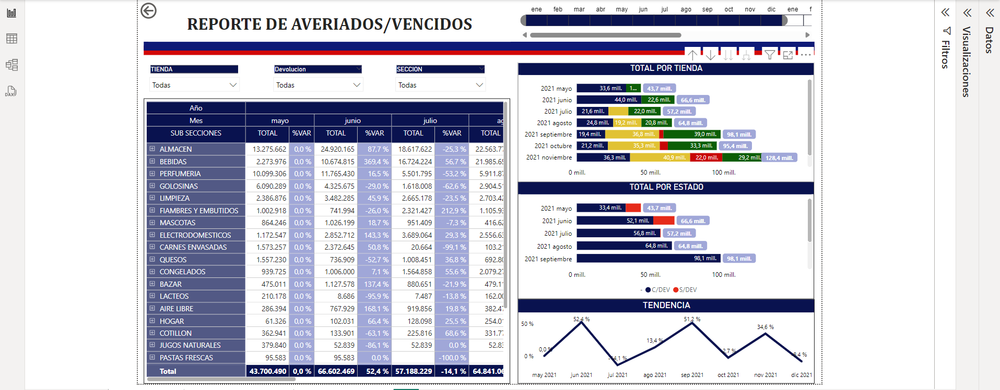
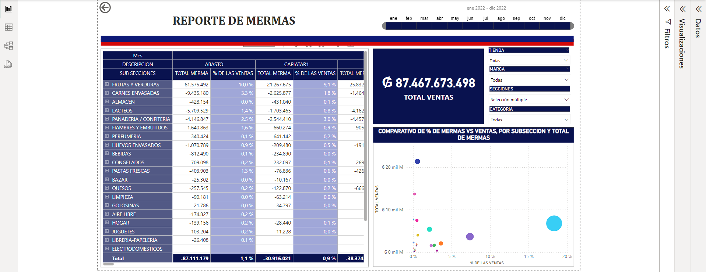
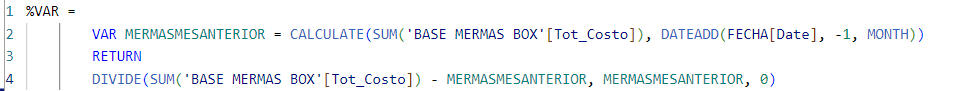
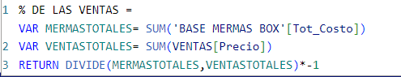

# **POWER BI REPORTS**.

## **Inventory losses**.

     In this initial report, I downloaded all inventory loss data from Inventiva ERP to an XML file. Subsequently, I embarked on modeling in Power Query, establishing connections, applying DAX formulas, and constructing visualizations to present crucial information for business decisions.

### DAX formulas for this report. ###

> [!NOTE]
> To illustrate the variation between the current month and the previous month, you can calculate the percentage change using
 this formula.

> [!NOTE]
> Percentage of losses incurred in relation to the total sales revenue.