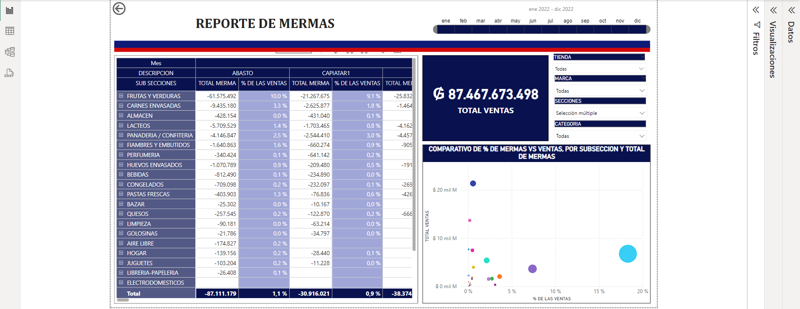

# **POWER BI REPORTS**.

## **Inventory losses**.

     In this first report I downloaded all inventory losses data from Inventiva ERP to xml file, then I started modeling in power
     queary, making connections, applying DAX formulas and building visualizations to show important informations for business 
     decisions.

### DAX formulas for this report. ###

> [!NOTE]
> To show variation between actual month and last month.

> [!NOTE]
> Losses percentage on sales.

