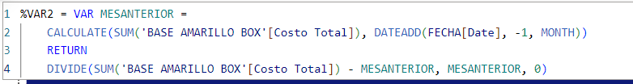

# POWER BI REPORTS.

## Inventory losses.

    In this first report I downloaded all inventory losses data from Inventiva ERP to xml file, then I started modeling in power
     queary, making connections, applying DAX formulas and building visualizations to show important informations for business 
     decisions.

### DAX formulas for this report. ###

To show variation between actual month and last month.