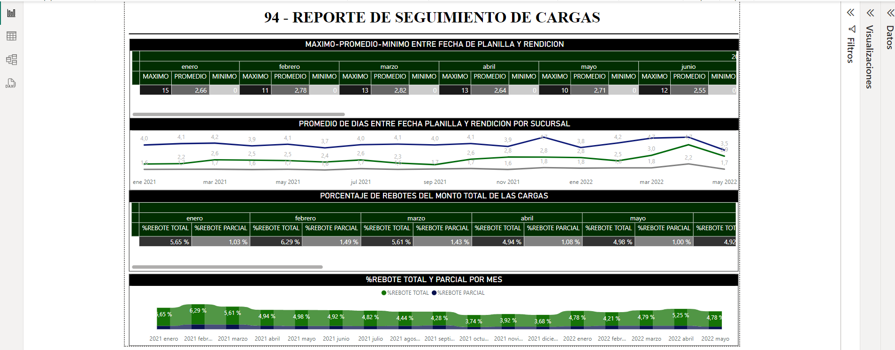
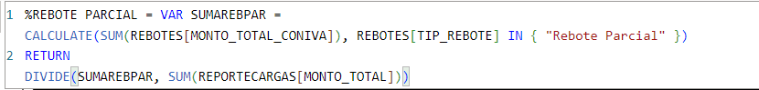
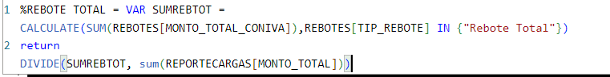

# **Shipment tracking report**.

     In this report, I downloaded all shipment tracking data from Inventiva ERP to an XML file. Subsequently, I embarked on
     modeling in Power Query, establishing connections, applying DAX formulas, and constructing visualizations to present crucial
     information for business decisions..

## DAX formulas for this report.

> [!NOTE]
> Formula to calculate the total sum of partial merchandise returns.

> [!NOTE]
> Formula to calculate the total sum of total merchandise returns.

> [!NOTE]
> To calculate the days elapsed between the shipment date and the delivery date.

